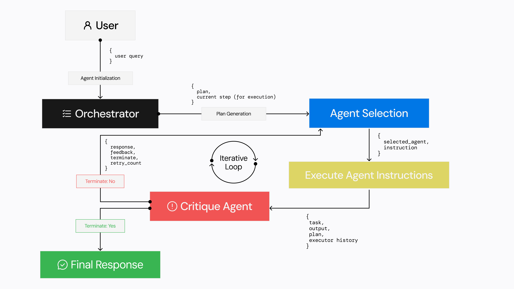

<p align="center">
  
</p>

# TheAgenticBench

## Table of Contents
- [Overview](#Overview)
- [Pre-Built Agent Library](#Pre-Built-Agent-Library)
- [Workflow](#Workflow)
- [Quick Start](#Quick-Start)
- [Add New Agent](#Add-New-Agent)
- [License](#License)

---

## Overview

TheAgenticBench is an open-source Digital Worker framework designed for building advanced research automation and business process automation workflows. Move beyond rigid SaaS workflows by leveraging AI agents that dynamically plan, execute, and refine tasks in real-time.

With a pre-built suite of intelligent agents, TheAgenticBench empowers businesses to automate complex workflows seamlessly. It also allows for the integration of custom AI agents, providing domain-specific adaptability and enhanced performance.

All operated via a natural language interface.

Key Features:


✅ **AI-Powered Orchestration** – Intelligent reasoning-enabled agents autonomously determine and execute the optimal workflow.

✅ **Dynamic Workflow Execution** – No more fixed logic; workflows adapt based on real-time conditions.

✅ **Workflow-as-an-API** – Easily deploy automated processes as REST APIs for seamless integration.

✅ **Privacy & Control** – Self-host or deploy securely, ensuring data sovereignty and IP protection.

✅ **Open-Source & Extensible** – Customize and expand with additional AI agents tailored to your business needs.

---

## Pre-Built Agent Library:

- **Orchestrator Agent**: The brain of the system. It takes an input, devises an execution plan, assigns tasks to other agents, and manages workflow execution dynamically.
- **Web Agent** ([TheAgenticBrowser](https://github.com/TheAgenticAI/TheAgenticBrowser)): Automates web navigation, data extraction, and interaction with web pages for real-time research and information retrieval.
- **Local File Agent**: Interacts with local or remote file systems, enabling document processing, downloads, and file manipulations.
- **RAG Agent**: An advanced retrieval-augmented generation (RAG) AI agent that enhances responses by integrating uploaded documents, datasets, or knowledge bases for fact-based reasoning.
- **Code Generator Agent**: Generates code snippets required to transform or process data from other agents, ensuring workflows remain adaptable and efficient.
- **Code Executor Agent**: Executes code generated by the Coder Agent, handling error detection and automatic retries for robust automation.
- **API Agent**: Executes REST API calls to interact with external services, databases, or SaaS platforms, enabling seamless third-party integrations.

---

## How It Works:



The following are the different processes in a typical execution workflow with TheAgenticBench:

1. **Agents Initialization**: All the existing agents are initialized based on their dependencies and parameters as a first step
2. **Task Planning**: A planner agent(sub agent of the Orchestrator) generates a detailed plan based on user query and the agents available which shall be followed as a source of truth in the entire query execution.
3. **Select Next Agent**: An iterative process begins where first step is the Selector Agent (sub-agent of the Orchestrator) which selects the next agent according to the plan. This Agent returns the next Agent to be called, generates an instruction for the next agent to follow, and gives an explaination justifying its decision.
4. **Execute Agent Instruction**: The Agent selected in previous step is called with the generated instruction.
5. **Critique**: The Critique Agent(sub-agent of the Orchestrator) takes in consideration output of all previous agents, looks through the plan and gives feedback whether the agent correctly executed the asked instruction. It returns a flag terminate(bool) which says if the current agent's task is completed or not. Based on this, next agent is selected.

---


## Quick Start


### Docker Setup
- Clone the Agentic Bench repo including the submodules (Agentic Browser)
  ```
  git clone --recurse-submodules https://github.com/TheAgenticAI/agentic-bench.git
  ```
- Setup the environment variables
  ```
  cp example.env .env
  ```
- [Additional Step] (Only for Docker Desktop)
  > Ref: https://docs.docker.com/engine/network/drivers/host/ 
  - Sign in to your Docker account in Docker Desktop.
  - Navigate to Settings.
  - Under the Resources tab, select Network.
  - Check the Enable host networking option.
  - Select Apply and restart.

    
- Run all docker configuration
  ```
  docker-compose up
  ```
- Access the services
  ```
  Frontend: (http://localhost:3000)
  Agentic Bench: (http://localhost:8081) or (http://localhost:8081/docs to access the APIs)
  Agentic Browser: (http:localhost:8000) or (http://localhost:8000/docs to access the APIs)
  ```

---

## Add New Agent
Follow the steps drafted in [CustomAgentInstructions.md](CustomAgentInstructions.md) to setup and spin your custom agent super quick!

---

## License

This project is licensed under the [Agentic Community License Agreement](LICENSE).

---

